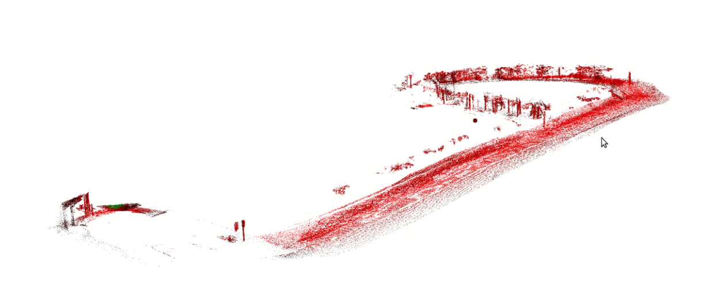
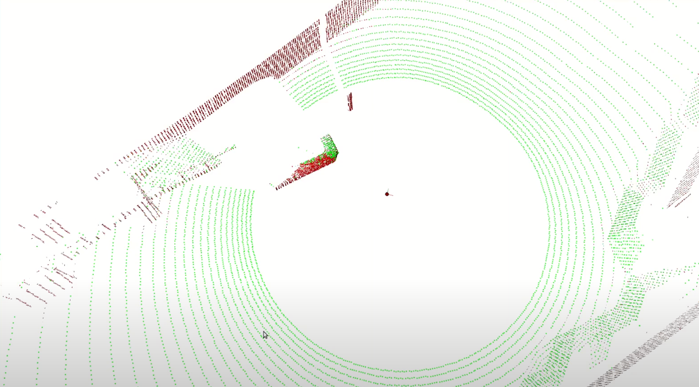

# Lidar point cloud to Voxel for 3D Reconstruction and mapping

Following is the work done by me while working as Research Intern at IHMC. 
Used java implementation of [OctoMap](https://octomap.github.io/).

OctoMap:
OcTree data structure based division of world in voxels to create a 3D model of the world for reconstruction and mapping. 

# Work Done:

1. Taking point cloud from lidar, transform the point cloud with respect to `odom` frame of the robot using transformation from SLAM module using point cloud library.
2. Converting every point cloud to lidar scan and insert it into a single octree.
3. Optimized the algorithm to construct a 3D octree in real time as point clouds are received from Lidar.
4. Visualized the 3D octree using 3D Mesh using JavaFX
5. Adding layers in the octree datastructure to store per voxel information example object detection, semantic segmentation, etc.

The pipeline of the work is as following:

# Output

3D Voxel based map: 

Output of normal estimation and angle threshold based color:

# Video

Following is the video of the output of 3D world reconstructed real time:

# Learning:

1. Learnt to code in Java
2. Implemented an algorithm to 3D reconstruct the world using octree datastructure
3. Learnt meshes, how to create and visualize them
4. Learnt a lot on algorithm optimization and point cloud processing to acheive real time performance of the system.
